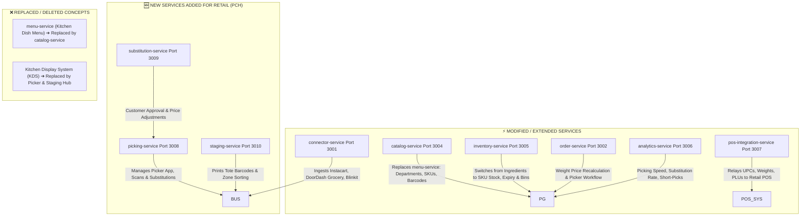

# 🛒 Pinaka Commerce Hub (PCH) — Architecture & Domain Specification
## Transitioning Pinaka Delivery Hub (PDH) from Restaurant to Retail & Grocery

**Document Version:** 1.0.0  
**Date:** August 20, 2026  
**Status:** ARCHITECTURAL SPECIFICATION & BLUEPRINT 📐  
**Scope:** Convenience Stores, Supermarkets, Hypermarts, Quick-Commerce (Q-Commerce)  

---

## Executive Summary

**Pinaka Commerce Hub (PCH)** expands the core event-driven, microservice-based middleware architecture of **Pinaka Delivery Hub (PDH)** from restaurant food delivery to the **Retail & Grocery** sector (Convenience Stores, Supermarkets, Dark Stores, Q-Commerce).

While PDH focuses on **Dish-based cataloging, kitchen prep status, raw ingredient deduction, and fixed dish options**, PCH introduces **SKU/UPC barcode tracking, barcode-scanned picker workflows, item substitutions, variable weight pricing (catch-weight), cold-chain staging, batch/expiry tracking, and department/aisle catalog management**.

---

## 🏛️ 1. High-Level Comparison: PDH (Restaurant) vs. PCH (Retail & Grocery)

| Feature Dimension | 🍔 PDH (Restaurant) | 🛒 PCH (Retail & Grocery) |
| :--- | :--- | :--- |
| **Primary Aggregators** | DoorDash, Uber Eats, Swiggy, Zomato, GrubHub | Instacart, DoorDash Grocery, Uber Eats Convenience, Amazon Fresh, Blinkit, Zepto, Shopify |
| **Catalog Model** | Categories -> Dishes -> Option Groups / Modifiers | Departments -> Categories -> Aisles -> SKUs / Barcodes (UPC/EAN) / Variants |
| **Pricing Engine** | Fixed Dish Price + Modifier Costs | Unit Price, Variable/Catch-Weight (`$ / kg` or `$ / lb`), BOGO/Tier Promotions, Tax Code / HSN |
| **Order Preparation** | Kitchen Cook / Assembly Line (`IN_KITCHEN` -> `READY_FOR_PICKUP`) | Store Picker Scanning & Packing (`PICKING` -> `SUBSTITUTION_APPROVAL` -> `PACKED_STAGED`) |
| **Inventory Engine** | Recipe-based ingredient deduction (e.g. 1 Pizza = 200g Dough, 50g Cheese) | Direct SKU Unit & Weight deduction with Batch/Lot tracking and Expiry (FEFO) |
| **Out-of-Stock Flow** | Instant 86-iteming (Item marked unavailable across platforms) | Real-time Picker Substitution (Replace brand, weight difference adjustment, refund) |
| **Storage & Handling** | Hot Bag vs Cold Bag | Multi-zone Temperature Staging (Ambient, Chilled, Frozen, Hazmat/Alcohol) |
| **POS System Integration** | Restaurant POS / WooCommerce Kitchen Display System (KDS) | Retail POS (NCR, LS Retail, Lightspeed, Square Retail, WooCommerce SKUs) with UPC verification |

---

## 🔄 2. Data Model & Canonical Schema Differences

### A. Canonical Order Schema (`libs/canonical-model`)

In PDH, orders follow a static restaurant line item format. In PCH, the model is extended to `CanonicalRetailOrder`:

```typescript
// Enums Comparison
export enum RetailOrderStatus {
  CREATED = 'CREATED',
  ACCEPTED = 'ACCEPTED',
  PICKING_IN_PROGRESS = 'PICKING_IN_PROGRESS',  // Replaces IN_KITCHEN
  AWAITING_SUBSTITUTION_APPROVAL = 'AWAITING_SUBSTITUTION_APPROVAL', // New
  PACKED_STAGED = 'PACKED_STAGED',               // Replaces READY_FOR_PICKUP
  OUT_FOR_DELIVERY = 'OUT_FOR_DELIVERY',
  DELIVERED = 'DELIVERED',
  CANCELLED = 'CANCELLED',
}

export enum PlatformSource {
  INSTACART = 'INSTACART',                       // New
  DOORDASH_GROCERY = 'DOORDASH_GROCERY',         // New
  UBER_CONVENIENCE = 'UBER_CONVENIENCE',         // New
  BLINKIT = 'BLINKIT',                           // New
  ZEPTO = 'ZEPTO',                               // New
  SHOPIFY = 'SHOPIFY',                           // New
  WOOCOMMERCE = 'WOOCOMMERCE',
}

export enum TemperatureZone {
  AMBIENT = 'AMBIENT',
  CHILLED = 'CHILLED',
  FROZEN = 'FROZEN',
  HAZMAT_ALCOHOL = 'HAZMAT_ALCOHOL',
}

// Line Item Schema Changes
export interface RetailOrderItem {
  id: string;
  sku: string;                                  // New: Stock Keeping Unit
  upcBarCode: string;                           // New: Universal Product Code / EAN
  name: string;
  quantityRequested: number;                    // New: Units requested
  quantityPicked: number;                       // New: Units actually picked
  isWeightBased: boolean;                       // New: True for produce/meat sold by weight
  unitOfMeasure?: 'KG' | 'GRAM' | 'LB' | 'OZ' | 'UNIT'; // New
  estimatedWeight?: number;                     // New
  actualWeight?: number;                        // New: Measured on picker scale
  unitPrice: number;
  totalPrice: number;                           // Adjusted based on actual weight
  temperatureZone: TemperatureZone;            // New: Staging classification
  aisleLocation?: { aisle: string; shelf: string; bin: string }; // New: Picking guidance
  substitutionAllowed: boolean;                 // New
  substitutedWithItem?: {                       // New: Handling replaced items
    sku: string;
    name: string;
    upcBarCode: string;
    quantity: number;
    unitPrice: number;
  };
  itemStatus: 'PENDING' | 'PICKED' | 'SUBSTITUTED' | 'OUT_OF_STOCK' | 'REFUNDED'; // New
}
```

---

## 🧩 3. Services & Microservices Topology Changes



### Detailed Breakdown of Services (Additions, Deletions, Modifications)

#### 1. ❌ DELETIONS & REPLACEMENTS
* **`apps/menu-service` ➔ REPLACED BY `apps/catalog-service` (Port 3004)**
  * *Reason:* Restaurants work with static menus, dish modifiers, and 86-iteming. Retail requires hierarchical cataloging (Department -> Category -> Subcategory -> Aisle -> SKU/UPC), multi-pack variants, brand taxonomy, barcode management, and tax rules.
* **Kitchen Prep Workflows ➔ REPLACED BY Picker Workflow**
  * *Reason:* Cooking status (`IN_KITCHEN`) is obsolete. Retail orders require item scanning, weight verification, and tote staging.

#### 2. 🆕 ADDITIONS FOR PCH
* **`apps/picking-service` (Port 3008)**
  * *Purpose:* Orchestrates the order picking process for handheld barcode scanner devices / mobile apps used by store staff.
  * *Features:* Directs pickers along the shortest route through store aisles, validates scanned UPC barcodes, captures scale weight readings for produce/meat, and logs picked vs out-of-stock items.
* **`apps/substitution-service` (Port 3009)**
  * *Purpose:* Handles out-of-stock item replacement rules.
  * *Features:* Recommends best alternative SKUs based on store inventory, triggers customer push notifications/SMS for substitution approval, recalculates order balance based on substitute item price differences.
* **`apps/staging-service` (Port 3010)**
  * *Purpose:* Organizes picked items into staging bins/totes by storage temperature zone (`AMBIENT`, `CHILLED`, `FROZEN`, `HAZMAT/ALCOHOL`).
  * *Features:* Generates bin labels/barcodes, alerts pickers if cold-chain items stay out of refrigeration beyond allowed SLA.

#### 3. ⚡ MODIFICATIONS TO EXISTING SERVICES
* **`apps/connector-service` (Port 3001):**
  * Add webhook adapters for Instacart, DoorDash Grocery, Uber Eats Convenience, Blinkit, Zepto, and Shopify.
  * Parse variable weights, UPC/EAN barcodes, customer substitution preferences (`Contact Me`, `Best Match`, `Do Not Substitute`).
* **`apps/inventory-service` (Port 3005):**
  * Transition from recipe-based raw ingredient tracking to SKU-level store/warehouse inventory.
  * Add **Batch/Lot management**, **Expiry Date tracking (FEFO - First Expired First Out)**, **Aisle/Shelf Location tracking**, and **Safety Stock Buffer per platform**.
* **`apps/pos-integration-service` (Port 3007):**
  * Integrate with Retail POS systems (NCR, LS Retail, Square Retail, Lightspeed, WooCommerce SKUs).
  * Send final post-pick order payloads with actual weights, substituted barcodes, and PLU codes.
* **`apps/order-service` (Port 3002):**
  * Recalculate financial subtotals post-picking when actual item weights or substitutions differ from estimated checkout amounts.
* **`apps/analytics-service` (Port 3006):**
  * Add retail-specific KPIs: Picker throughput (items picked/hour), Substitution approval rate, Out-of-Stock loss rate, Cold-chain compliance percentage.

---

## 🐳 4. Infrastructure & Container Matrix Updates

| Infrastructure Component | PDH (Restaurant) | PCH (Retail & Grocery) | Purpose / Change |
| :--- | :--- | :--- | :--- |
| **PostgreSQL Database** | `pinaka_delivery_hub` | `pinaka_commerce_hub` | New schemas for `skus`, `barcodes`, `aisles`, `picking_sessions`, `substitutions`, `tote_staging` |
| **Redis Cache Keys** | `order:<id>`, `menu:<id>` | `order:<id>`, `catalog:<sku>`, `picker:<id>`, `staging:<bin>` | In-memory fast read cache for SKUs, picking routes, and bin locations |
| **RabbitMQ Queues** | `pdh_orders_queue` | `pch_orders_queue`<br>`pch_picking_queue`<br>`pch_substitutions_queue`<br>`pch_staging_queue` | Event queues for real-time picker notification, customer substitution approvals, and staging alerts |

---

## 🏁 5. Phase-by-Phase Roadmap to Transition PDH ➔ PCH

1. **Phase 1: Domain & Canonical Schema Refactoring**
   * Extend `libs/canonical-model` to support `RetailOrder`, `RetailOrderItem`, UPC/EAN barcodes, variable weights, and `RetailOrderStatus`.
2. **Phase 2: Retail Catalog Microservice (`catalog-service`)**
   * Upgrade `menu-service` to `catalog-service` supporting multi-level department hierarchies, SKUs, barcodes, and price overrides.
3. **Phase 3: Picker & Substitution Engine (`picking-service` + `substitution-service`)**
   * Build the picking state machine, barcode scanner validation endpoints, and weight capture logic.
4. **Phase 5: Inventory & Cold-Chain Staging Upgrade (`inventory-service` + `staging-service`)**
   * Add SKU batching, expiry date rules, aisle bin management, and temperature zone staging tracking.
5. **Phase 6: Retail Connectors & POS Relay**
   * Implement Instacart and Retail Webhook ingestion in `connector-service` and integrate barcode/PLU mapping in `pos-integration-service`.

---
