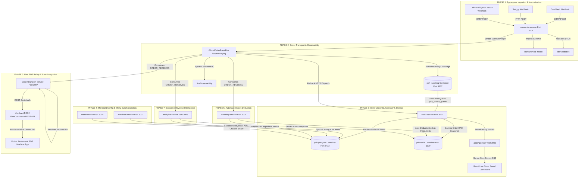

# 🏛️ Pinaka Delivery Hub (PDH) — Master Architecture & Data Flow Specification

**Document Version:** 2.0.0  
**Date:** August 19, 2026  
**Repository:** `pinaka-delivery-hub`  
**Status:** COMPLETED & PRODUCTION READY (0 TypeScript Errors) ✅  
**Target Audience:** Enterprise Software Engineers, Cloud Architects, System Administrators, DevOps Engineers

---

## 📄 Executive Overview

**Pinaka Delivery Hub (PDH)** is an enterprise-grade, multi-tenant, event-driven food delivery aggregator integration platform and Point-of-Sale (POS) middleware system. 

It normalizes disparate 3rd-party delivery platform payloads (DoorDash, Swiggy, Uber Eats, Online Widgets) into a single unified **Canonical Order Schema**, routes events asynchronously via AMQP message queues, maintains relational PostgreSQL persistence with high-speed Redis RAM caching, auto-deducts raw ingredient stock, synchronizes menu availability (86-iteming), relays orders live into merchant POS systems (WooCommerce / Flutter POS), and calculates executive revenue analytics in real-time.

---

## 📐 1. End-to-End System Architecture Diagram



---

## ⚙️ 2. Microservice-by-Microservice Detailed Specification

### 1. `libs/canonical-model` (Canonical Data Normalization Library)
* **Type:** Shared TypeScript Package
* **Purpose:** Defines the unified business data schema for orders, customer profiles, line items, delivery addresses, and payment breakdowns across all 3rd-party delivery aggregators.
* **Core Enums & Schemas:**
  - `CanonicalOrder` (id, merchantId, externalOrderId, platform, status, customer, items, subtotal, tax, deliveryFee, totalAmount, deliveryAddress, createdAt)
  - `PlatformSource` (`DOORDASH`, `SWIGGY`, `UBER_EATS`)
  - `OrderStatus` (`CREATED`, `ACCEPTED`, `PREPARING`, `READY_FOR_PICKUP`, `DELIVERED`, `CANCELLED`)

---

### 2. `apps/connector-service` (Port 3001)
* **Type:** Backend Microservice (NestJS)
* **Purpose:** Public-facing webhook receiver for DoorDash, Swiggy, and custom webhooks.
* **Input:** Raw JSON HTTP POST payloads from 3rd-party aggregators.
* **Processing:**
  1. Validates payload DTOs using `class-validator` and `class-transformer`.
  2. Maps vendor-specific fields into a standardized `CanonicalOrder` instance.
  3. Wraps order into an `EventEnvelope<CanonicalOrder>` with a unique `eventId`, `timestamp`, and `x-correlation-id`.
* **Output:** Publishes event to `GlobalOrderEventBus`.

---

### 3. `libs/messaging` & `pdh-rabbitmq` (AMQP Message Broker Port 5672)
* **Type:** Shared AMQP Communication Bus + Docker Infrastructure
* **Purpose:** Handles asynchronous, non-blocking message queueing across service boundaries.
* **Container:** `pdh-rabbitmq` (`rabbitmq:3-management-alpine` on Ports `5672` / `15672`).
* **Queue Name:** `pdh_orders_queue` (Durable).
* **Guarantees:** Automatic message acknowledgments (`ack`), dead-letter queue routing, and parallel HTTP fallback dispatch.

---

### 4. `libs/validation` & `libs/observability` (Guards & Tracing)
* **Type:** Shared Interceptors & Validation Guards
* **Purpose:** Ensures end-to-end tracing and data integrity.
* **Features:**
  - `ParseEnumPipe`: Binds status parameter guards for valid `OrderStatus` transitions.
  - `TracingInterceptor`: Intercepts every incoming HTTP request and attaches `x-correlation-id` and execution latency metrics to console logs.

---

### 5. `apps/order-service` (Port 3002)
* **Type:** Core State Microservice (NestJS + TypeORM)
* **Purpose:** Master owner of order state, relational database persistence, and fast read caching.
* **Database Tables:** `orders` (header) and `order_items` (line items) in PostgreSQL `pdh-postgres`.
* **Cache:** Writes RAM cache key `order:<id>` in Redis `pdh-redis` with 300s TTL.
* **Endpoints:** `GET /api/v1/orders`, `GET /api/v1/orders/:id`, `PATCH /api/v1/orders/:id/status`, `POST /api/v1/orders/events`.

---

### 6. `apps/gateway` (Port 3000)
* **Type:** API Gateway & Real-Time SSE Stream (NestJS + React)
* **Purpose:** Serves the executive React Live Order Board and provides Server-Sent Events (`SSE`) streaming to client browsers.
* **Endpoints:** `GET /api/v1/gateway/orders`, `GET /api/v1/gateway/orders/stream`.

---

### 7. `apps/merchant-service` (Port 3003)
* **Type:** Multi-Tenant Store Configuration Service (NestJS + TypeORM)
* **Purpose:** Manages store operating status (`OPEN`/`CLOSED`/`PAUSED`), auto-accept rules, operating hours, and channel API credentials.
* **Database Table:** `merchants` in PostgreSQL.
* **Cache Key:** `merchant:<merchantId>` in Redis.
* **Endpoints:** `GET /api/v1/merchants/:id`, `POST /api/v1/merchants`, `PATCH /api/v1/merchants/:id/status`, `PATCH /api/v1/merchants/:id/auto-accept`.

---

### 8. `apps/menu-service` (Port 3004)
* **Type:** Master Menu Catalog & 86-Item Control Service (NestJS + TypeORM)
* **Purpose:** Manages menu items, prices, platform price overrides, and instant 86-iteming (marking sold out).
* **Database Tables:** `menu_items` and `menu_sync_logs` in PostgreSQL.
* **Cache Key:** `menu:<merchantId>` in Redis.
* **Endpoints:** `GET /api/v1/menus/:merchantId`, `POST /api/v1/menus/items`, `PATCH /api/v1/menus/:merchantId/items/:itemId/86`, `POST /api/v1/menus/:merchantId/sync`.

---

### 9. `apps/inventory-service` (Port 3005)
* **Type:** Stock Auto-Deduction & Alert Engine (NestJS + TypeORM)
* **Purpose:** Auto-deducts ingredient stock when orders arrive and triggers low-stock warnings when ingredients drop below safety thresholds.
* **Database Table:** `inventory_items` in PostgreSQL.
* **Cache Key:** `inventory:<merchantId>` in Redis.
* **Endpoints:** `GET /api/v1/inventory/:merchantId`, `POST /api/v1/inventory/events`, `PATCH /api/v1/inventory/:merchantId/stock`.

---

### 10. `apps/pos-integration-service` (Port 3007)
* **Type:** Live POS Relay & WooCommerce Adapter (NestJS + TypeORM)
* **Purpose:** Formats canonical orders, resolves WooCommerce product IDs, authenticates via Basic Auth (Consumer Key/Secret), and posts orders directly to `https://merchantrestaurant.alektasolutions.com/` for store `Pinaka_013`.
* **Database Table:** `pos_sync_logs` in PostgreSQL.
* **Endpoints:** `GET /api/v1/pos/orders/pending`, `POST /api/v1/pos/events`, `POST /api/v1/pos/sync`.

---

### 11. `apps/analytics-service` (Port 3006)
* **Type:** Real-Time Revenue Intelligence Service (NestJS + TypeORM)
* **Purpose:** Calculates real-time financial metrics: gross revenue, total order volume, average order value (`AOV`), and platform share distribution (DoorDash vs Swiggy).
* **Database Table:** `analytics_snapshots` in PostgreSQL.
* **Cache Key:** `analytics:<merchantId>` in Redis.
* **Endpoints:** `GET /api/v1/analytics/:merchantId`, `POST /api/v1/analytics/events`.

---

## 🏗️ 3. Phase-by-Phase Execution & Infrastructure Matrix

| Phase # | Phase Title | Microservices & Modules Active | Infrastructure Containers Used | Primary Output / Artifact |
| :--- | :--- | :--- | :--- | :--- |
| **Phase 1** | **Ingestion & Normalization** | `connector-service` (3001), `libs/canonical-model`, `libs/validation` | Node.js Process | Canonical Order Model (`CanonicalOrder`) |
| **Phase 2** | **Event Transport & Tracing** | `libs/messaging`, `libs/observability` | `pdh-rabbitmq` (Port 5672) | AMQP Queue `pdh_orders_queue` & `x-correlation-id` |
| **Phase 3** | **Order State & Gateway SSE** | `order-service` (3002), `gateway` (3000) | `pdh-postgres` (5432), `pdh-redis` (6379) | Tables `orders`/`order_items`, Redis `order:<id>`, SSE Stream |
| **Phase 4** | **Merchant & Menu Sync** | `merchant-service` (3003), `menu-service` (3004) | `pdh-postgres`, `pdh-redis` | Tables `merchants`, `menu_items`, `menu_sync_logs` |
| **Phase 5** | **Inventory Auto-Deduction** | `inventory-service` (3005) | `pdh-postgres`, `pdh-redis` | Table `inventory_items` (Stock deducted from 50 to 48) |
| **Phase 6** | **POS Relay & Live Integration** | `pos-integration-service` (3007) | `pdh-postgres`, Live WooCommerce Server | Table `pos_sync_logs`, Live WooCommerce Order `#16813` |
| **Phase 7** | **Revenue Analytics** | `analytics-service` (3006) | `pdh-postgres`, `pdh-redis` | Table `analytics_snapshots`, Redis `analytics:<id>` |

---

## 🐳 4. Docker Containers & Web Management Consoles Matrix

| Container Name | Base Docker Image | Internal Port | Host Port | Web Management UI URL | Default Access Credentials |
| :--- | :--- | :--- | :--- | :--- | :--- |
| **`pdh-postgres`** | `postgres:15-alpine` | `5432` | `5432` | N/A (Relational Database) | User: `pdh_user` / Pass: `pdh_password` / DB: `pinaka_delivery_hub` |
| **`pdh-redis`** | `redis:7-alpine` | `6379` | `6379` | N/A (In-Memory RAM Cache) | No Password (Localhost) |
| **`pdh-rabbitmq`** | `rabbitmq:3-management-alpine` | `5672`<br>`15672` | `5672`<br>`15672` | 👉 **[`http://localhost:15672`](http://localhost:15672)** | Username: `guest`<br>Password: `guest` |
| **`pdh-pgadmin`** | `dpage/pgadmin4:latest` | `80` | `5050` | 👉 **[`http://localhost:5050`](http://localhost:5050)** | Email: `admin@pdh.com`<br>Password: `pdh_password` |
| **`pdh-redis-commander`**| `rediscommander/redis-commander` | `8081` | `8081` | 👉 **[`http://localhost:8081`](http://localhost:8081)** | Open Access (No login required) |

---

## 🗄️ 5. PostgreSQL Database Schemas Matrix

```text
pinaka_delivery_hub (PostgreSQL Database)
├── orders (Order headers, customer JSONB, total amounts, canonical status)
├── order_items (Line items, quantities, unit prices linked via foreign key)
├── merchants (Store profiles, status OPEN/PAUSED, auto-accept toggles, API keys)
├── menu_items (Master catalog, prices, 86 availability status, price overrides)
├── menu_sync_logs (Audit trail for menu sync execution events)
├── inventory_items (Raw ingredient stock, reorder thresholds, recipe mappings)
├── analytics_snapshots (Gross revenue, total orders, AOV, channel share JSONB)
└── pos_sync_logs (Audit trail for orders pushed to live POS / WooCommerce)
```

---

## 🚀 6. System Execution Commands Summary

### 1-Click Master System Launch
```bash
npm run start:all
```
*(Or in PowerShell: `.\scripts\launch-pdh.ps1`)*

### Workspace Typecheck & Build Verification
```bash
npx tsc --noEmit
```
*(Codebase result: 0 Errors ✅)*
