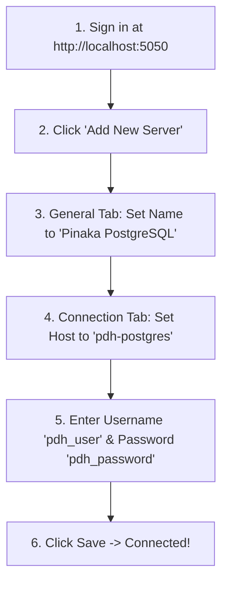

# 🐘 Pinaka Delivery Hub — pgAdmin 4 Web UI User Guide

**Module:** Database Management & Visual SQL Inspection  
**URL:** [http://localhost:5050](http://localhost:5050)  
**Database Server Container:** `pdh-postgres` (Port `5432`)  
**pgAdmin Container:** `pdh-pgadmin` (Port `5050`)  
**Status:** ACTIVE ✅

---

## 📌 Overview

This document provides a step-by-step walkthrough for developers, managers, and system administrators to access, configure, and inspect the PostgreSQL database visually using the browser-based **pgAdmin 4** management console.

---

## 🔑 Login Credentials

Open your web browser and navigate to **[http://localhost:5050](http://localhost:5050)**.

| Field | Value |
| :--- | :--- |
| **Login URL** | [`http://localhost:5050`](http://localhost:5050) |
| **Email Address** | `admin@pdh.com` |
| **Password** | `pdh_password` |

---

## ⚙️ Initial Server Connection Setup

After signing into pgAdmin for the first time, follow these steps to register your local PostgreSQL database server:



### Detailed Connection Fields

1. Click **Add New Server** on the Dashboard homepage.
2. Under the **General Tab**:
   * **Name:** `Pinaka PostgreSQL`
3. Click the **Connection Tab** and enter:
   * **Host name/address:** `pdh-postgres` *(or `host.docker.internal`)*
   * **Port:** `5432`
   * **Maintenance database:** `pinaka_delivery_hub`
   * **Username:** `pdh_user`
   * **Password:** `pdh_password`
   * **Save Password:** Check the box ✅
4. Click **Save**.

---

## 📊 How to Inspect & View Database Tables

Once connected, expand the left sidebar tree as follows:

```text
Servers
 └── Pinaka PostgreSQL
      └── Databases
           └── pinaka_delivery_hub
                └── Schemas
                     └── public
                          └── Tables
                               ├── orders (Canonical Order Records)
                               └── order_items (Line Item Breakdown)
```

### 👁️ View Table Rows Visually
1. Right-click on **`orders`** table.
2. Navigate to **View/Edit Data** ➔ Select **All Rows**.
3. A spreadsheet grid will display all saved order records with their **UUID Primary Keys**, **Platform Sources**, **Statuses**, and **JSONB Customer Details**.

---

## 🔍 Running Custom SQL Queries

To run custom SQL queries in pgAdmin:
1. Select **`pinaka_delivery_hub`** database from the left panel.
2. Click the **Query Tool** button (lightning bolt icon ⚡) on the top toolbar.
3. Paste any SQL query and click **Execute (F5)**:

```sql
-- View all DoorDash orders
SELECT id, "externalOrderId", platform, status, "totalAmount", "createdAt"
FROM orders
WHERE platform = 'DOORDASH';

-- Count total orders by status
SELECT status, COUNT(*) 
FROM orders 
GROUP BY status;
```

---

## 🛠️ Troubleshooting Connection Issues

* **Error: `Connection Refused`**
  * **Solution:** Verify that PostgreSQL container is running by typing `docker ps` in your terminal. Ensure container `pdh-postgres` shows `Up`.
* **Host Address for Docker vs Native:**
  * Inside Docker network: Use **`pdh-postgres`**
  * If running native Windows PostgreSQL: Use **`host.docker.internal`**
