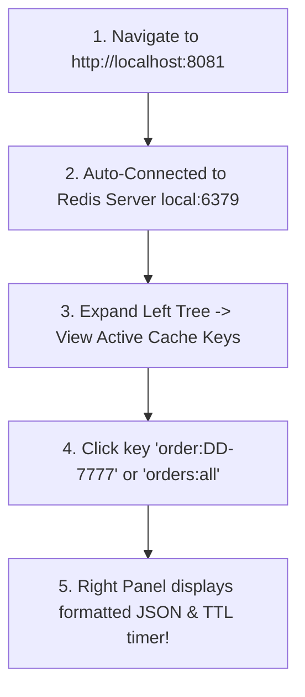

# ⚡ Pinaka Delivery Hub — Redis Commander Web UI User Guide

**Module:** Redis High-Speed RAM Cache & Keys Inspection  
**URL:** [http://localhost:8081](http://localhost:8081)  
**Redis Container:** `pdh-redis` (Port `6379`)  
**Redis Commander Container:** `pdh-redis-commander` (Port `8081`)  
**Status:** ACTIVE ✅

---

## 📌 Overview

This document provides a step-by-step user guide for developers, project leads, and system administrators to access, inspect, and manage high-speed Redis RAM cache keys visually using the browser-based **Redis Commander** management console.

---

## 🔑 Access Details

Open your web browser and navigate directly to:

| Parameter | Access Detail |
| :--- | :--- |
| **Web Dashboard URL** | [`http://localhost:8081`](http://localhost:8081) |
| **Authentication** | None (Auto-connected to `local:redis:6379`) |
| **Host Target** | `pdh-redis` Container (Port `6379`) |

---

## 🖥️ Navigating the Dashboard



---

## 📊 Key Naming Conventions Used in Project

| Key Pattern | Data Type | Description | Expiration (TTL) |
| :--- | :--- | :--- | :--- |
| **`order:<externalOrderId>`** | `String (JSON)` | Cached Canonical Order payload (e.g. `order:DD-7777`) | `300s` (5 min) |
| **`order:<uuid>`** | `String (JSON)` | Cached Canonical Order payload by UUID | `300s` (5 min) |
| **`orders:all`** | `String (JSON Array)` | Cached list of all active orders | `300s` (5 min) |

---

## ⚡ Useful Redis Commander Features

1. **View Raw JSON & Formatting:** Clicking any key on the left sidebar automatically formats raw JSON order bodies.
2. **TTL Inspection:** Displays exact remaining seconds before a cache key auto-expires.
3. **Manual Key Invalidation:** Click the **Delete** button next to any key to immediately purge stale cache during local debugging.
4. **Add New Key / Test Key:** Click **Add Key** on top to manually inject temporary test keys into Redis memory.

---

## 🛠️ CLI Quick Reference Alternative

If you prefer terminal commands over browser GUI:

```powershell
# List all active Redis keys
docker exec pdh-redis redis-cli KEYS "*"

# Read JSON payload of key
docker exec pdh-redis redis-cli GET "order:DD-7777"

# Check remaining TTL in seconds
docker exec pdh-redis redis-cli TTL "order:DD-7777"

# Purge all Redis cache memory
docker exec pdh-redis redis-cli FLUSHALL
```
