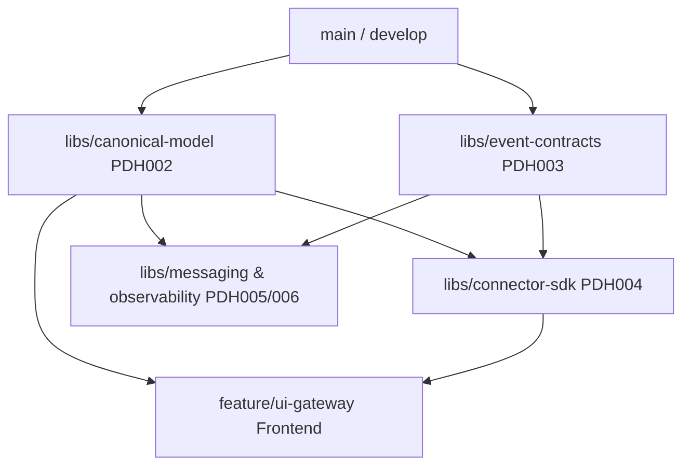
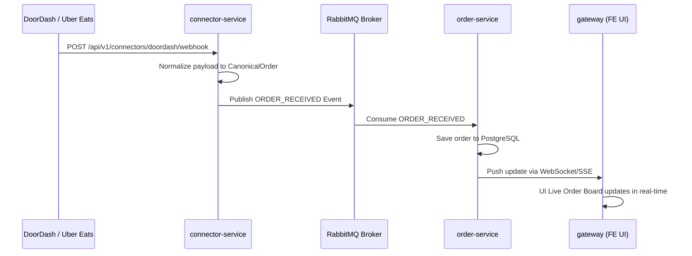

# Pinaka Delivery Hub - Step-by-Step Implementation & Execution Guide

## 📌 Executive Summary & Team Structure
This document serves as the master reference guide for the **Pinaka Delivery Hub (PDH)** project team. It details the setup, branch allocation, module dependencies, technical architecture, and end-to-end execution flow.

### Team Roles & Branch Mapping

| Role | Developer | Assigned Branch | Scope / Module | Target Location |
| :--- | :--- | :--- | :--- | :--- |
| **Architect / Lead** | Dev 1 | `main` / `develop` | Scaffolding, CI/CD, Monorepo structure, PR Merges | Workspace Root |
| **Backend Lead** | Backend Dev 1 | `feature/canonical-model`<br>`feature/event-contracts` | **PDH002 / PDH003**: Normalized Order Model & Event Envelope Contracts | [`libs/canonical-model`](file:///c:/Projects/pinaka-delivery-hub/libs/canonical-model)<br>[`libs/event-contracts`](file:///c:/Projects/pinaka-delivery-hub/libs/event-contracts) |
| **Backend Dev** | Backend Dev 2 | `feature/connector-sdk` | **PDH004**: Connector interface, SDK, and Food Aggregator Adapters (DoorDash, Uber Eats, Swiggy, Zomato) | [`libs/connector-sdk`](file:///c:/Projects/pinaka-delivery-hub/libs/connector-sdk)<br>[`apps/connector-service`](file:///c:/Projects/pinaka-delivery-hub/apps/connector-service) |
| **Backend Dev** | Backend Dev 3 | `feature/messaging-env`<br>`feature/observability` | **PDH005 / PDH006**: Local RabbitMQ/Kafka client abstraction, logging, tracing, correlation IDs | [`libs/messaging`](file:///c:/Projects/pinaka-delivery-hub/libs/messaging)<br>[`libs/observability`](file:///c:/Projects/pinaka-delivery-hub/libs/observability) |
| **Frontend Devs** | FE Dev 1<br>FE Dev 2<br>FE Dev 3 | `feature/ui-gateway` | **Frontend Gateway**: Dashboard shell, Live Order Monitor, Connector Management UI, WebSockets feed | [`apps/gateway`](file:///c:/Projects/pinaka-delivery-hub/apps/gateway) |

---

## 🏗️ Execution Workflow & Dependency Tree



---

## 🚀 Phase 1: Local Infrastructure Bootstrap (Day 1)

### 1. Install Workspace Dependencies
Run in project root:
```bash
pnpm install
# OR
npm install
```

### 2. Start Local Infrastructure Containers
Spin up PostgreSQL, Redis, and RabbitMQ:
```bash
docker compose up -d
```

### 3. Verify Container Ports & Web Interfaces
- **PostgreSQL 16**: `localhost:5432` (`pdh_user` / `pdh_password` / `pinaka_delivery_hub`)
- **Redis 7**: `localhost:6379`
- **RabbitMQ Management**: [`http://localhost:15672`](http://localhost:15672) (`guest` / `guest`)

---

## 📦 Phase 2: Core Foundation Sprint (Days 2–3)

> **CRITICAL PATH:** Backend Dev 1 MUST complete `canonical-model` and `event-contracts` first and merge into `develop`.

### 1. Git Workflow
```bash
git checkout develop
git pull origin develop
git checkout -b feature/canonical-model
```

### 2. Code Reference: Shared Canonical Model (`libs/canonical-model/src/index.ts`)
```typescript
export enum OrderStatus {
  CREATED = 'CREATED',
  ACCEPTED = 'ACCEPTED',
  IN_KITCHEN = 'IN_KITCHEN',
  READY_FOR_PICKUP = 'READY_FOR_PICKUP',
  OUT_FOR_DELIVERY = 'OUT_FOR_DELIVERY',
  DELIVERED = 'DELIVERED',
  CANCELLED = 'CANCELLED',
}

export enum PlatformSource {
  DOORDASH = 'DOORDASH',
  UBER_EATS = 'UBER_EATS',
  GRUBHUB = 'GRUBHUB',
  SWIGGY = 'SWIGGY',
  ZOMATO = 'ZOMATO',
  WOOCOMMERCE = 'WOOCOMMERCE',
}

export interface OrderCustomer {
  id?: string;
  fullName: string;
  phone: string;
  email?: string;
}

export interface OrderItem {
  id: string;
  externalItemId: string;
  name: string;
  quantity: number;
  unitPrice: number;
  options?: Array<{ name: string; value: string; price: number }>;
}

export interface CanonicalOrder {
  id: string;
  merchantId: string;
  externalOrderId: string;
  platform: PlatformSource;
  status: OrderStatus;
  customer: OrderCustomer;
  items: OrderItem[];
  subtotal: number;
  tax: number;
  deliveryFee: number;
  totalAmount: number;
  deliveryAddress: {
    street: string;
    city: string;
    zipCode: string;
    coordinates?: { latitude: number; longitude: number };
  };
  createdAt: string;
  updatedAt: string;
}
```

### 3. Code Reference: Event Contracts (`libs/event-contracts/src/index.ts`)
```typescript
export interface EventEnvelope<T = any> {
  eventId: string;
  eventType: 'ORDER_RECEIVED' | 'ORDER_STATUS_CHANGED' | 'MENU_SYNC_REQUESTED';
  source: string;
  timestamp: string;
  correlationId: string;
  version: string;
  payload: T;
}
```

---

## 🔀 Phase 3: Parallel Development Tracks (Days 4–8)

### Track A: Backend Connector SDK (`libs/connector-sdk/src/index.ts`)
```typescript
import { CanonicalOrder, PlatformSource } from '@pinaka-delivery-hub/canonical-model';

export interface ConnectorResponse<T> {
  success: boolean;
  data?: T;
  error?: string;
}

export abstract class BaseConnector {
  abstract readonly platform: PlatformSource;

  abstract parseWebhookPayload(rawBody: any, headers: Record<string, string>): CanonicalOrder;

  abstract updateOrderStatus(externalOrderId: string, status: string): Promise<ConnectorResponse<boolean>>;
}
```

### Track B: Frontend Live Order Monitor (`apps/gateway/src/components/LiveOrderMonitor.tsx`)
```tsx
import React, { useEffect, useState } from 'react';
import { CanonicalOrder, OrderStatus } from '@pinaka-delivery-hub/canonical-model';

export const LiveOrderMonitor: React.FC = () => {
  const [orders, setOrders] = useState<CanonicalOrder[]>([]);

  useEffect(() => {
    const eventSource = new EventSource('/api/v1/gateway/orders/stream');
    
    eventSource.onmessage = (event) => {
      const newOrder: CanonicalOrder = JSON.parse(event.data);
      setOrders((prev) => [newOrder, ...prev]);
    };

    return () => eventSource.close();
  }, []);

  const handleStatusUpdate = async (orderId: string, newStatus: OrderStatus) => {
    await fetch(`/api/v1/gateway/orders/${orderId}/status`, {
      method: 'PATCH',
      headers: { 
        'Content-Type': 'application/json',
        'x-correlation-id': crypto.randomUUID()
      },
      body: JSON.stringify({ status: newStatus }),
    });
  };

  return (
    <div className="p-6 bg-slate-900 text-white rounded-xl shadow-lg">
      <h2 className="text-2xl font-bold mb-4">🔴 Live Orders Feed</h2>
      <div className="grid grid-cols-1 md:grid-cols-3 gap-4">
        {orders.map((order) => (
          <div key={order.id} className="p-4 bg-slate-800 rounded-lg border border-slate-700">
            <div className="flex justify-between items-center mb-2">
              <span className="font-semibold text-amber-400">{order.platform}</span>
              <span className="px-2 py-1 text-xs rounded bg-blue-600">{order.status}</span>
            </div>
            <p className="text-sm font-medium">Order #{order.externalOrderId}</p>
            <p className="text-xs text-gray-400">Total: ${order.totalAmount.toFixed(2)}</p>
            <div className="mt-4 flex gap-2">
              <button 
                onClick={() => handleStatusUpdate(order.id, OrderStatus.ACCEPTED)}
                className="px-3 py-1 bg-green-600 hover:bg-green-500 rounded text-xs">
                Accept
              </button>
              <button 
                onClick={() => handleStatusUpdate(order.id, OrderStatus.READY_FOR_PICKUP)}
                className="px-3 py-1 bg-purple-600 hover:bg-purple-500 rounded text-xs">
                Ready
              </button>
            </div>
          </div>
        ))}
      </div>
    </div>
  );
};
```

---

## 💻 Phase 4: Local Execution Commands

### Launching All Workspace Services via Nx
```bash
npx nx run-many -t serve --parallel=5
```

### Launching Individual Microservices
- **Gateway**: `npx nx serve gateway`
- **Orders Service**: `npx nx serve order-service`
- **Connector Service**: `npx nx serve connector-service`

---

## 🧪 Phase 5: Verification Sequence



### Test Command (Simulated Ingestion Webhook)
Run in PowerShell:
```powershell
Invoke-RestMethod -Uri "http://localhost:3000/api/v1/connectors/doordash/webhook" `
  -Method POST `
  -Headers @{ "Content-Type" = "application/json"; "x-correlation-id" = "test-12345" } `
  -Body '{"order_id": "DD-9921", "store_id": "STORE-01", "total": 24.50, "items": [{"name": "Burger", "qty": 2, "price": 12.25}]}'
```

---

## ✅ Sprint Completion Checklist

- [ ] Local Docker services (`PostgreSQL`, `Redis`, `RabbitMQ`) healthy.
- [ ] `canonical-model` & `event-contracts` built and merged to `develop`.
- [ ] `connector-service` normalizes webhooks to `CanonicalOrder`.
- [ ] `order-service` consumes events and stores orders in PostgreSQL.
- [ ] Frontend Gateway renders live orders feed with real-time status updates.
